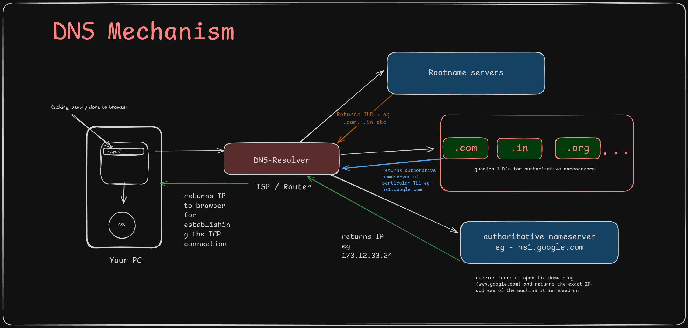

## DNS-Resolver using Golang

- The following is a simple implementation of how a DNS Resolver actually works, and how it maps ip-address to incoming domain-name requests and reponds it back.

- We use a recursive approach by starting at a rootname server ( queried to by the DNS resolvers), and go down till we find the match recursively( i.e. IP address) and return it.

- There are a total of **13** rootnameservers in the world, and multiple servers **anycast** these rootnameserver ip's.

#### References:
- [How DNS really works and how it scales infinitely](https://www.youtube.com/watch?v=g_gKI2HCElk&t=1s)
- [Building a recursive dns resolver in go](https://timothya.com/blog/dns/)

#### Architecture:
